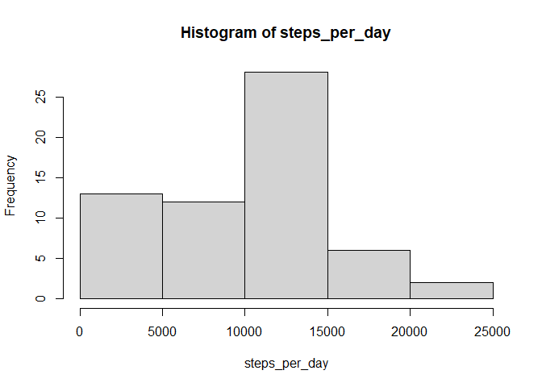
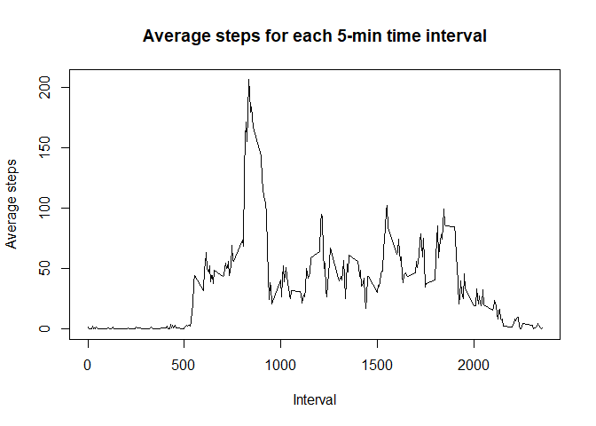
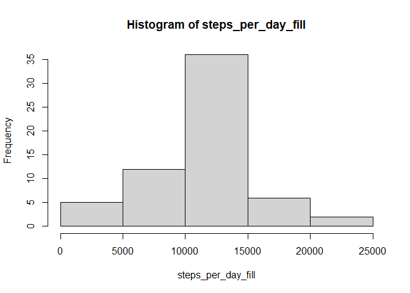
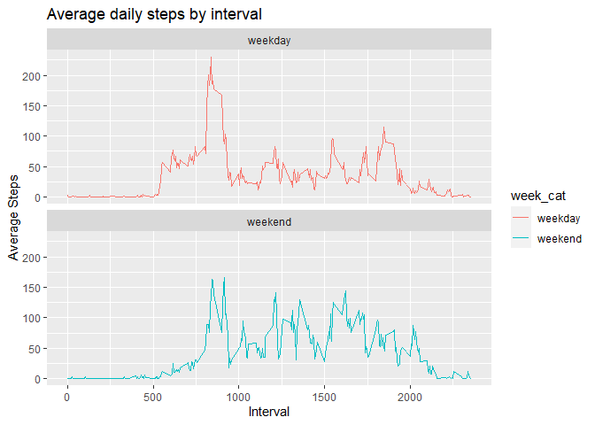

### Loading and preprocessing the data

```r
if(!file.exists("activity.csv")) {
    unzip("activity.zip")
}
act <- read.csv("activity.csv")
```

Convert the date variable into the Date format:


```r
act$date <- as.Date(act$date, "%Y-%m-%d")
```

### What is the mean total number of steps taken per day?

Calculate total number of steps taken per day and plot it in a histogram:


```r
steps_per_day <- tapply(act$steps, act$date, sum, na.rm=TRUE)
hist(steps_per_day)
```

<!-- -->


```r
paste("Mean of steps per day:", mean(steps_per_day, na.rm = TRUE))
```

```
## [1] "Mean of steps per day: 9354.22950819672"
```

```r
paste("Median of steps per day:", median(steps_per_day, na.rm = TRUE))
```

```
## [1] "Median of steps per day: 10395"
```

### What is the average daily activity pattern?


```r
library(dplyr)
```

Calculate the average steps for each 5-min time interval across all days:


```r
steps_by_interval <- act %>%
                     group_by(interval) %>% 
                     summarize(avg = mean(steps, na.rm = TRUE))
```

Make a time-series plot of these average steps:


```r
plot(steps_by_interval, type="l", xlab="Interval", ylab="Average steps",
     main="Average steps for each 5-min time interval")
```

<!-- -->

Find 5-minute interval containing the maximum number of steps:


```r
steps_by_interval[which.max(steps_by_interval$avg), ]
```

```
## # A tibble: 1 × 2
##   interval   avg
##      <int> <dbl>
## 1      835  206.
```

### Imputing missing values
 
Calculate total numbers of missing values in the dataset:


```r
sum(is.na(act))
```

```
## [1] 2304
```

Create new dataset by filling the missing values with the average of the corresponding 5-minute interval:


```r
act_fill <- act %>% transform(
    steps = ifelse(
        is.na(steps),
        yes = subset(steps_by_interval, interval==interval)$avg,
        no = steps
        )
    )
```

Test if the new dataset really has no more missing values:


```r
sum(is.na(act_fill))
```

```
## [1] 0
```

Make a histogram of the total number of steps taken each day for the new data frame:


```r
steps_per_day_fill <- tapply(act_fill$steps, act_fill$date, sum)
hist(steps_per_day_fill)
```

<!-- -->


```r
paste("Mean of steps per day:", mean(steps_per_day_fill))
```

```
## [1] "Mean of steps per day: 10766.1886792453"
```

```r
paste("Median of steps per day:", median(steps_per_day_fill))
```

```
## [1] "Median of steps per day: 10766.1886792453"
```
The values are slightly higher than before the NA values were filled.

### Are there differences in activity patterns between weekdays and weekends?

Create a new factor variable in the dataset with two levels – “weekday” and “weekend” indicating whether a given date is a weekday or weekend day:


```r
act_fill <- act_fill %>% mutate(
    week_cat = factor(ifelse(weekdays(date) %in% c("Samstag", "Sonntag"),
                      yes = "weekend", no = "weekday")
               )
    )
```

Make a time-series plot comparing average daily steps between weekdays and weekends:


```r
library(ggplot2)
```


```r
# calculate aggregated steps
steps_by_interval_fill <- act_fill %>%
                     group_by(week_cat, interval) %>% 
                     summarize(avg = mean(steps))
# create plot
ggplot(steps_by_interval_fill, aes(x=interval, y=avg, color=week_cat)) +
    geom_line() + 
    labs(title="Average daily steps by interval", 
         x="Interval", y="Average Steps") +
    facet_wrap(~week_cat, nrow = 2)
```

<!-- -->

